#  Integracja TIA Portal z Factory IO dla Zautomatyzowanych Systemów Produkcyjnych

## O Projekcie
Jest to projekt sygnalizacji świetlnej zaimplementowanej w TIA Portal podłaczony do symualtora S7-1200 sterownika i zasymulowany w FactoryIO.
Projekt powstał na podstawie kursu online i został nieznacznie zmodyfikowany.
https://www.udemy.com/course/kurs-plc-simatic-siemens-s7-1200-od-podstaw
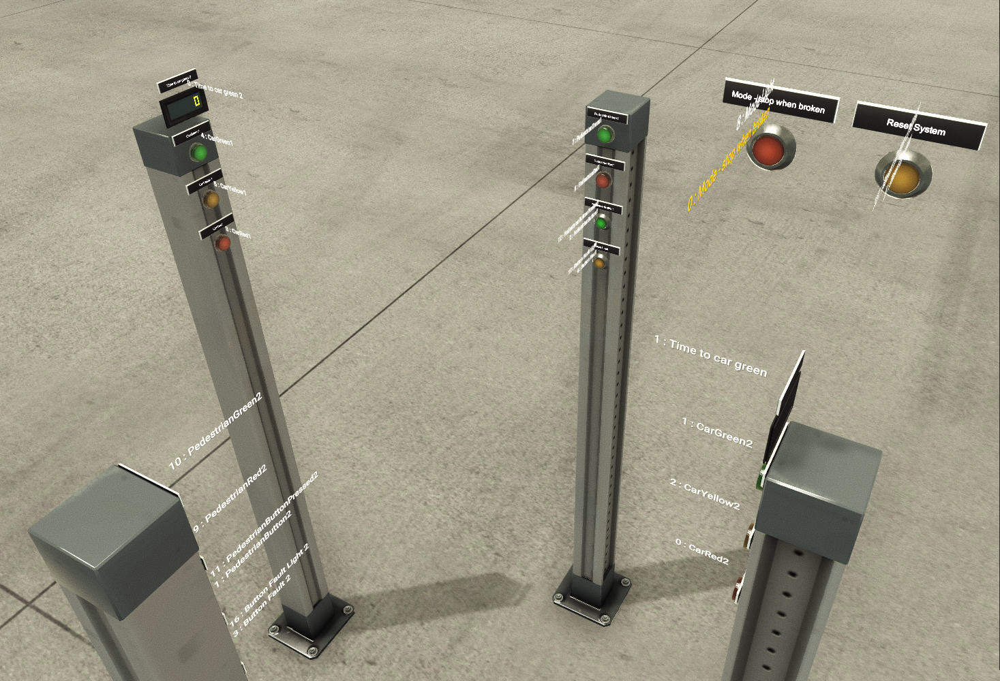

## Cele Projektu
- Nauka programowania PLC
- Poznanie Srodowiska TIA Portal
- Nauka sterownika Simatic S7-1200
- Poznanie możliwości symulatora FactoryIO

## Technologie i Narzędzia
Projekt wykorzystuje następujące technologie i narzędzia:
- TIA Portal
- Factory IO
- Simatic S7 PLCSIM S7-1200
- PlC Sim

## Funkcjonalność i Opis Działania 
### Główne Funkcje:
- System zarządza dwoma parami świateł, jedną dla samochodów i drugą dla pieszych.
Piesi mają do dyspozycji przyciski po obu stronach drogi, które pozwalają na aktywację zmiany świateł.

- Nad światłami dla samochodów wyświetla się w odpowiednim moemencie czas pozosały do zmiany światła na zielone.
### Projekt uwzględnia dwa tryby awaryjne w przypadku zepsucia przycisku:
- Tryb migania żółtymi światłami 
- Automatyczna zmiana sygnalizacji co określony czas, co zapewnia ciągłość przepływu ruchu pomimo awarii.
### Możliwość resetu systemu

## Sekwencje Sterowania
### Sygnalizacja dla Pieszych
- `Pedestrian_1`
- `Pedestrian_2`

### System Kontroli
- `SystemStopWhenBroken`
- `ResetSystem`
- `SystemStopBroken`

### Sekwencja Sygnalizacji
- `Sequence.PushButtonPressed`
- `Sequence.CarRed`
- `Sequence.CarGreen`
- `Sequence.CarYellowRed`
- `Sequence.PedestrianGreen`
- `Sequence.PedestrianToBlinking`
- `Sequence.PedestrianBlinking`

### Kontrola Świateł dla Samochodów
- `Car.Green`
- `Car.Red`
- `Car.Yellow`

### Kontrola Świateł dla Pieszych
- `Pedestrian.Green`
- `Pedestrian.Red`

### Drzewo Projektu , Main OB1

### Main OB1 networks
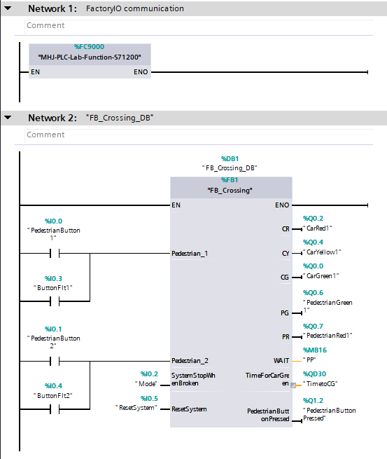
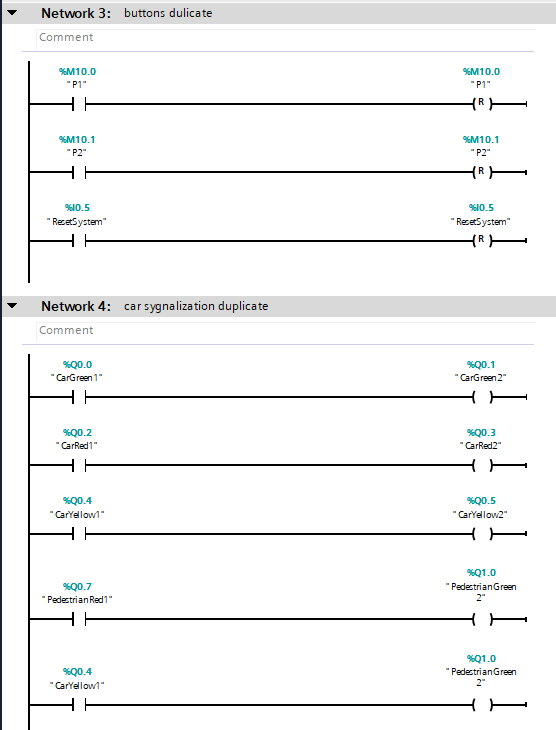
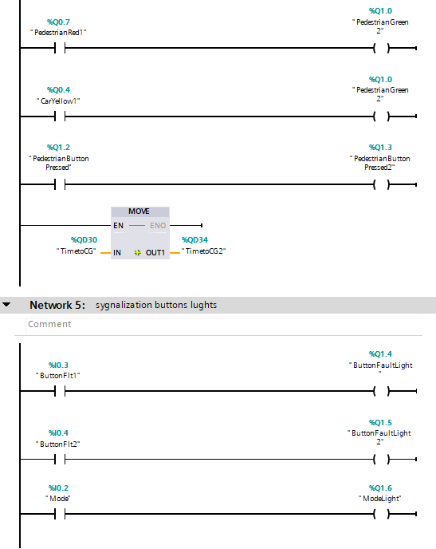

### FB1 Variables
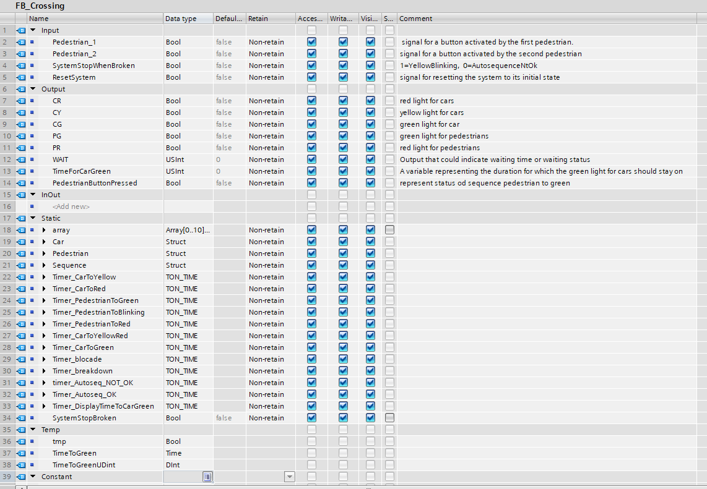
### Main FB1 networks 
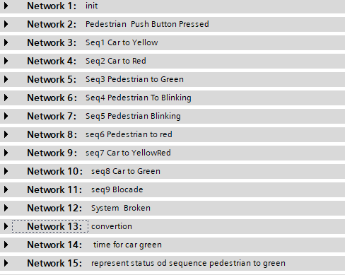
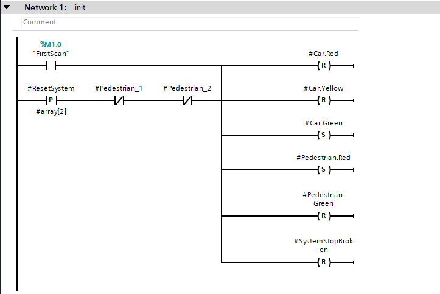
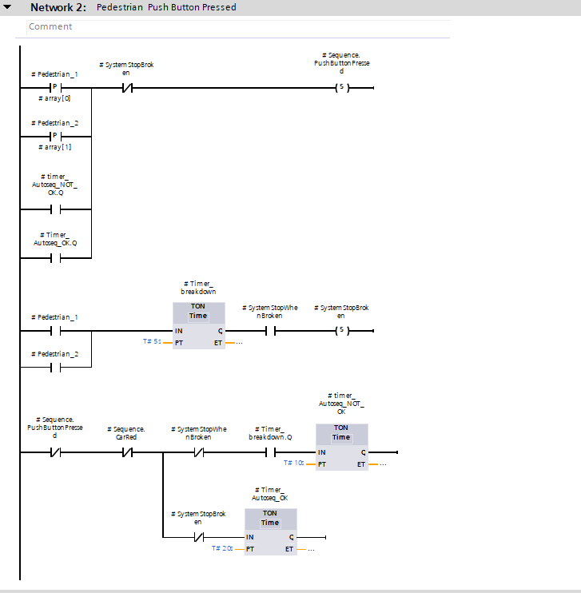
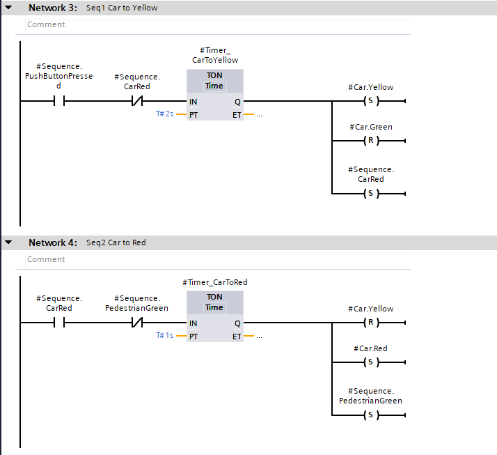
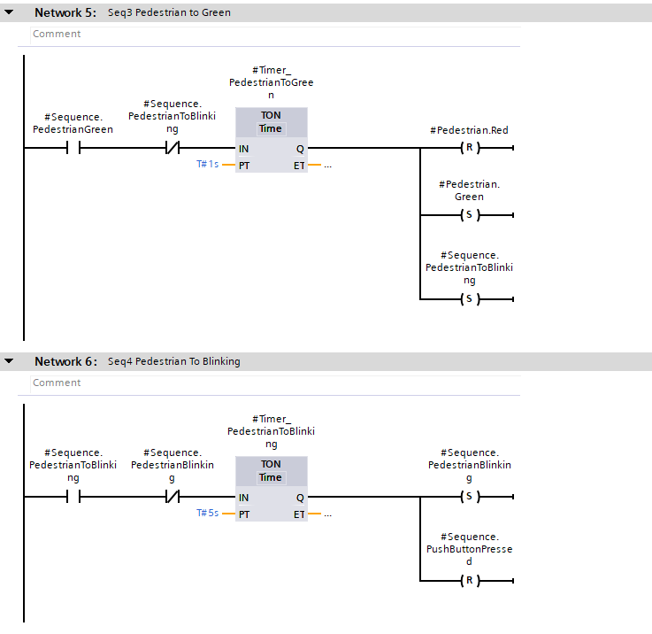
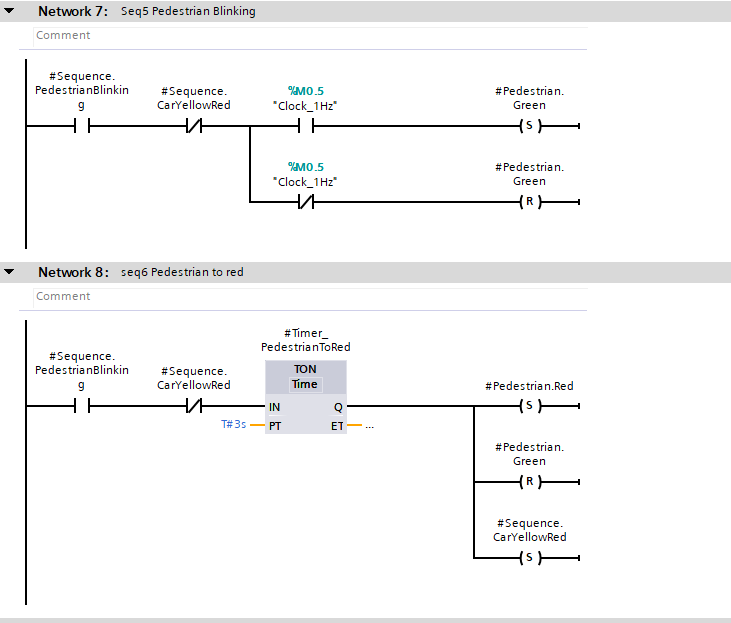
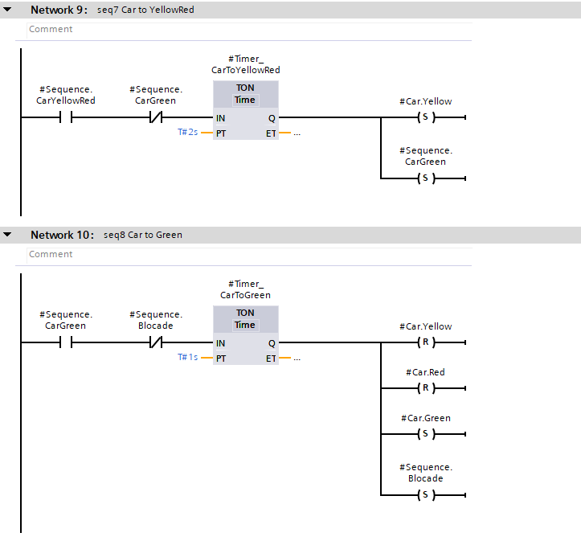
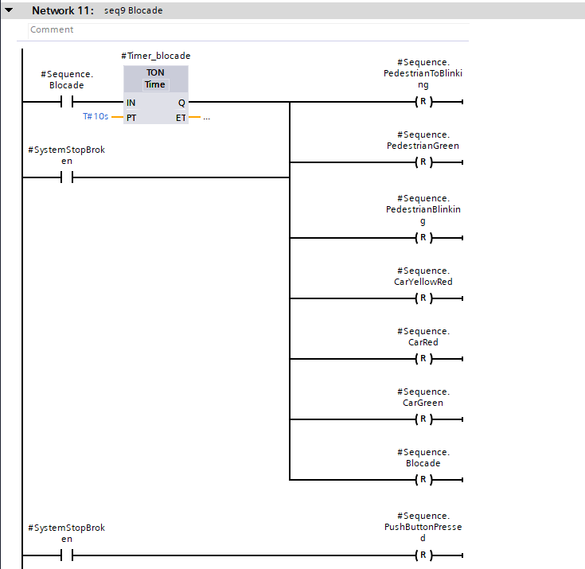
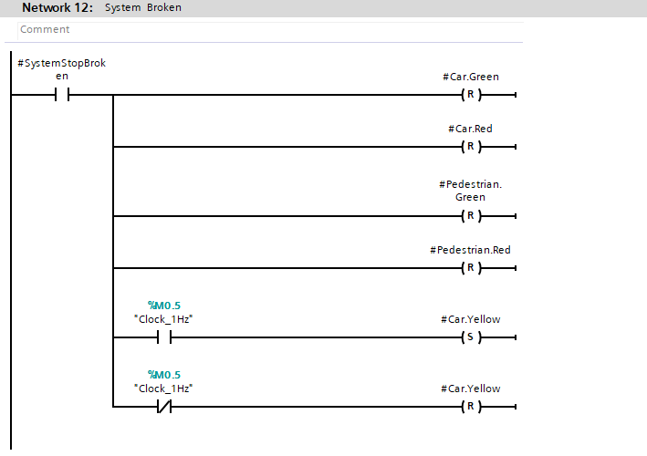
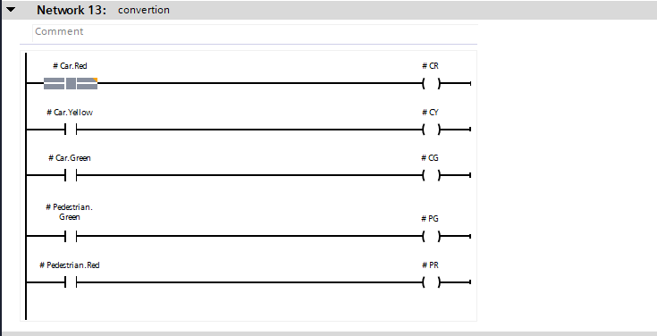
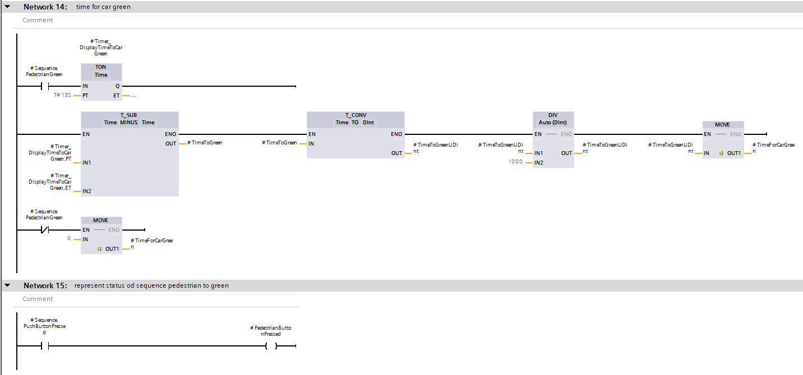

### watch table
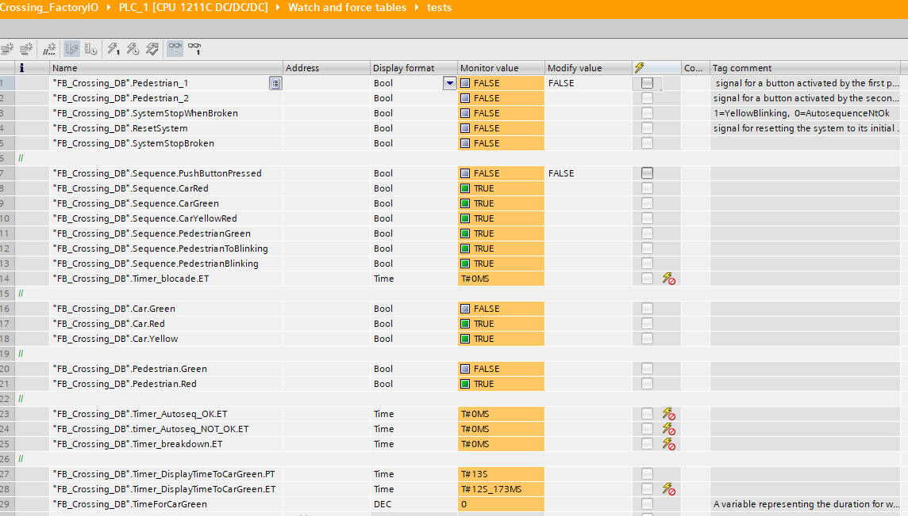

### PLC Tags
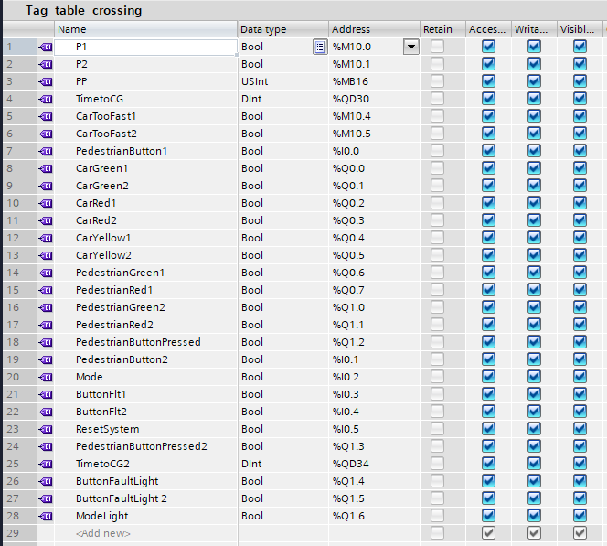
